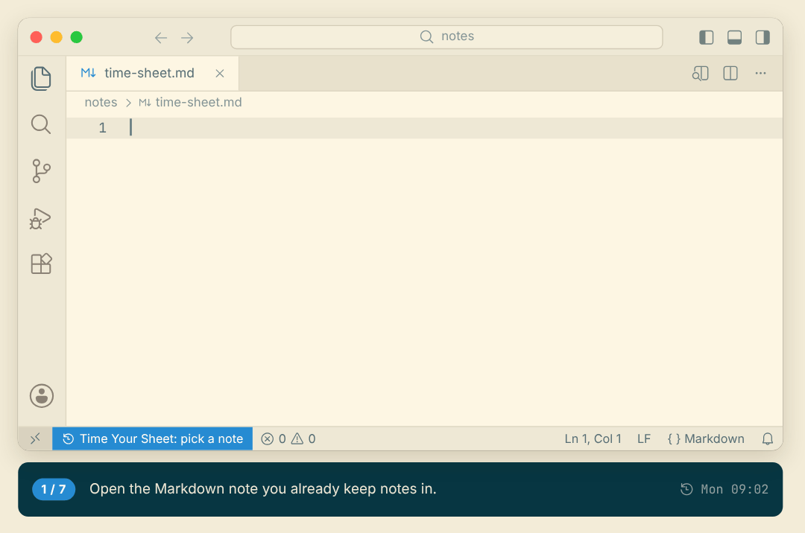
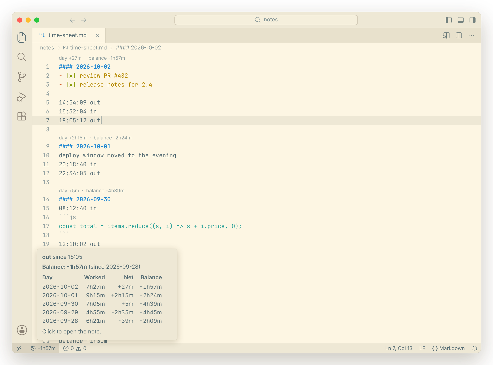
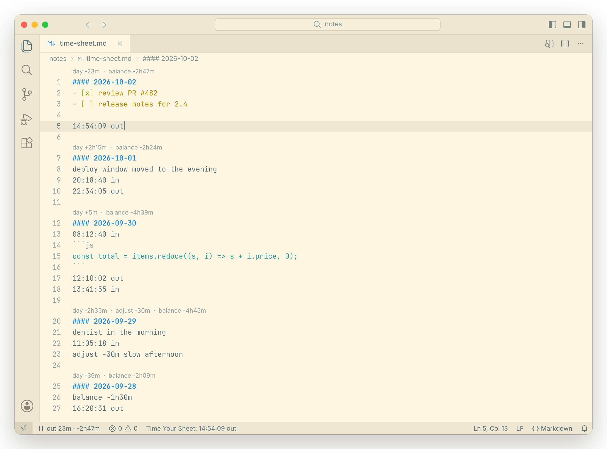
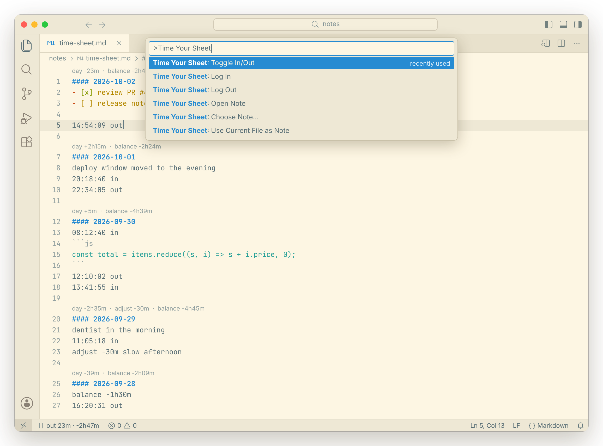

# Time Your Sheet

A flextime balance for people who keep a running Markdown note in VS Code.

You're assumed to be working during work hours. You only log the exceptions: stepping out, coming back, starting early, staying late. Time Your Sheet reads those lines from your note and keeps a running **debt** (`-45m`) or **advance** (`+2h15m`) in the status bar.

Your note stays the database. There's no server, no account and no separate file: just a few lines mixed in with everything else you write during the day.



*A 30-second tour: setup, stepping out, coming back, staying late, and the week's history.*



*Hover the status bar for the last few days. Each date header gets a one-line summary of that day and the running balance.*



*While you're out during work hours, the status bar counts the minutes and the debt grows live.*



*Toggle in/out from the command palette, or bind it to a shortcut.*

## The lines it understands

Everything else in the note is ignored, including anything inside fenced code blocks.

| Line | Meaning |
|---|---|
| `#### 2026-10-05` | A day. Any heading level works, and trailing text is fine (`#### 2026-10-05 Mon`). |
| `14:54:09 out` / `14:54 out` | You stopped working. |
| `15:32:04 in` | You started working again. |
| `balance -45m` | Your balance **at the start of this day**. The latest `balance` line is the starting point; everything before it is ignored. A sign is required: `-` for debt, `+` for advance (`balance 0` is fine). |
| `adjust -30m reason` | Manual correction for this day, e.g. writing off advance for an unfocused afternoon. A sign is required. |

Durations: `45m`, `2h`, `2h15m`, `90m`. Both `-` and `−` work as minus signs.

## How the balance is calculated

For each work day:

```
net = time worked − scheduled time + adjusts        (lunch excluded from both)
```

- **A normal day needs no lines at all.** No events means you worked your hours, so the day nets 0. The same goes for holidays and sick days: no lines, no debt.
- **The first event decides the morning.**
  - If it's `out`, you're taken to have been working since the start of work hours.
  - If it's an `in` before the end of work hours, you weren't working before it. `08:15 in` earns 45m; `09:40 in` costs 40m.
  - If it's an `in` after work hours (`20:18 in`), the day itself was normal and this is an evening session.
- **Lunch is ignored both ways.** Leaving during lunch costs nothing, working through it earns nothing, and overrunning it costs the overrun.
- **Staying late:** log `out` when you finish, e.g. `18:30 out` earns 1h30m. If you never log `out` after hours, the evening earns nothing. Forgetting costs you nothing, it just doesn't credit you.
- **Evening sessions:** `20:20 in` … `21:24 out` earns the time between them. If you were still "in" from the day (say `11:05 in` and you left at 17:00 without logging it), an evening `in` means you left at the end of work hours.
- **Leaving early:** a final `out` with no `in` after it means out for the rest of the day.
- **Today is live.** While you're out, the debt grows by the minute. The rest of today's schedule is assumed to be worked, so the balance doesn't drop the moment the day starts.
- **Weekends and other non-work days** have no schedule. Only explicit `in` → `out` pairs count, all as advance.

A session can't cross midnight: log `out` before midnight and `in` again after.

## Commands

| Command | |
|---|---|
| **Time Your Sheet: Toggle In/Out** | Logs whichever makes sense now. After work hours on a day you're still "in" from, it asks whether you stayed late (out) or are starting an evening session (in). |
| **Time Your Sheet: Log In** / **Log Out** | Explicit versions. Refuses to log the same state twice in a row. |
| **Time Your Sheet: Open Note** | Opens the note at today's section. Clicking the status bar item does the same. |
| **Time Your Sheet: Use Current File as Note** | Points the extension at the open file. |
| **Time Your Sheet: Choose Note…** | Use the open file or browse for one. Clicking the status bar does this when the note isn't set or can't be found. |

Renaming or moving the note inside VS Code updates the setting automatically. If you rename it outside VS Code (Finder, terminal), the status bar shows "note not found": click it to choose the file again.

Lines are written as `HH:MM:SS in|out` at the end of today's section. If today has no section yet, one is created above the newest day (or at the end of the file, see `newDaysOnTop`). If the note has unsaved changes, the line is added to the editor but nothing is saved for you.

No default shortcuts are set, to avoid clashes. Add your own in `keybindings.json`:

```json
[
  { "key": "ctrl+alt+cmd+t", "command": "timeyoursheet.toggle" },
  { "key": "ctrl+alt+cmd+i", "command": "timeyoursheet.in" },
  { "key": "ctrl+alt+cmd+o", "command": "timeyoursheet.out" }
]
```

## Settings

| Setting | Default | |
|---|---|---|
| `timeyoursheet.file` | | The note. Absolute, `~/…`, or relative to the first workspace folder. |
| `timeyoursheet.workHours` | `09:00-17:00` | |
| `timeyoursheet.lunch` | `12:00-13:00` | Leave empty to disable. |
| `timeyoursheet.workDays` | `[1,2,3,4,5]` | ISO weekdays, 1 = Monday. |
| `timeyoursheet.newDaysOnTop` | `true` | Where a new date header goes. |
| `timeyoursheet.headingPrefix` | `####` | Only used when the note has no date headers yet. |
| `timeyoursheet.codeLens` | `true` | Per-day summary above headers. |

Malformed lines, such as `balance 45m` without a sign or a second `out` in a row, are underlined as warnings in the note.

## Install

There's no Marketplace release yet. Build the package locally:

```sh
npm run package          # produces timeyoursheet-<version>.vsix
```

Then in VS Code: Extensions view → `…` menu → **Install from VSIX…**, and run **Developer: Reload Window**. (Or `code --install-extension timeyoursheet-<version>.vsix` if the `code` command is on your PATH.)

## Development

Plain JavaScript (CommonJS, which VS Code extensions load), no build step and no runtime dependencies.

```
src/extension.js        VS Code glue: commands, status bar, CodeLens, diagnostics
src/lib/duration.js     parse/format durations and clock times
src/lib/parse.js        note → days, events, balance/adjust lines
src/lib/compute.js      the balance model
src/lib/insert.js       where to write a new line
src/lib/present.js      status bar / tooltip / CodeLens text
src/lib/settings.js     settings validation
test/                   node:test suites; extension.test.js drives the glue through a fake vscode module
scripts/screenshots.js  renders images/*.png from the real status/CodeLens/tooltip code
scripts/demo-gif.js     renders images/demo.gif: a scripted day with captions, same code
```

```sh
npm test
```

To try it in a development host, open the folder in VS Code and press F5 ("Run Extension").

To regenerate the screenshots (they use a sample week from `scripts/sample-note.js`):

```sh
npm i --no-save playwright-core @vscode/codicons @fontsource/jetbrains-mono
node scripts/screenshots.js "/Applications/Google Chrome.app/Contents/MacOS/Google Chrome"
node scripts/demo-gif.js "/Applications/Google Chrome.app/Contents/MacOS/Google Chrome"   # also needs ffmpeg
```

## License

All rights reserved. See [LICENSE](LICENSE).
